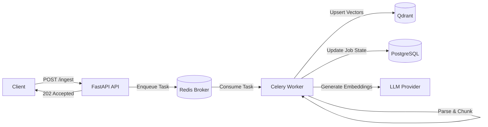

# AI Data Platform (Cortex)

A production-grade backend system for ingesting large documents, processing them asynchronously, generating vector embeddings, and serving low-latency semantic search and Retrieval-Augmented Generation (RAG) APIs.

This project is intentionally focused on **reliability, scalability, and real-world failure handling** - not demos or toy examples.

---

## Problem

Teams want to “chat with their data” - PDFs, internal documents, tickets, logs - but most systems fail in production due to:

- **Blocking APIs**  
  Parsing large documents synchronously freezes the server.

- **Data loss**  
  Transient failures during embedding generation silently drop tasks.

- **Poor scalability**  
  Naive designs collapse under concurrent uploads.

---

## Solution

The platform **decouples ingestion from processing** using an event-driven architecture.

APIs remain responsive while CPU- and I/O-heavy workloads are handled asynchronously by worker processes, enabling horizontal scaling and failure isolation.

---

## Architecture Overview

High-level data flow from ingestion to retrieval:



---

## Core Capabilities

- **Non-blocking ingestion**
  APIs return immediately (`202 Accepted`); heavy processing happens asynchronously.

- **Failure isolation & retries**
  Automatic retries with exponential backoff for transient failures (LLM, network, I/O).

- **Idempotent processing**
  File hashing prevents duplicate ingestion and inconsistent job state.

- **Hybrid semantic search**
  Dense vector retrieval combined with metadata filtering and pagination.

- **Explicit job lifecycle**
  Clear state transitions:
  `PENDING → PROCESSING → COMPLETED / FAILED`

---

## Tech Stack & Design Decisions

| Component      | Choice         | Why This Matters                                               |
| -------------- | -------------- | -------------------------------------------------------------- |
| API Layer      | FastAPI        | Native AsyncIO support and strict request validation           |
| Task Queue     | Celery + Redis | Durable queue with backpressure handling (vs in-process tasks) |
| Vector Store   | Qdrant         | HNSW indexing and metadata filtering outperform pgvector       |
| Metadata Store | PostgreSQL     | ACID guarantees for job state and consistency                  |
| Workers        | Process-based  | Avoids Python GIL limits for CPU-bound workloads               |
| Infrastructure | Docker Compose | Ensures dev–prod environment parity                            |

---

## Running Locally

Start all infrastructure:

```bash
make up
```

Trigger document ingestion:

```bash
curl -X POST \
  -F "file=@docs/sample.pdf" \
  http://localhost:8000/api/v1/ingest
```

Swagger UI:

```
http://localhost:8000/docs
```

---

## Scope & Intent

This repository is **not a tutorial**.

It exists to demonstrate:

- Production-safe concurrency
- Queue-driven system design
- Async APIs vs process-based workers
- Vector search trade-offs
- Failure-aware backend architecture

There is intentionally **no frontend UI**.
APIs are exercised via Swagger UI and HTTP clients to keep focus on backend correctness.

---

## Status

Actively developed as a reference implementation for **production-grade backend and AI infrastructure systems**.
