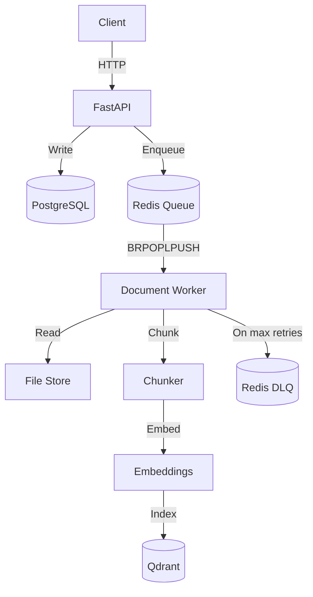

# Async RAG Ingestion Engine

Production-grade **document ingestion pipeline** designed for **reliable processing, idempotent indexing, and deterministic failure recovery**.

The system processes large volumes of documents and builds vector indexes while guaranteeing safe retries and predictable failure semantics.

Companion system: [transaction-engine](https://github.com/winsongr/transaction-engine)

---

## Key Design Goals

* Idempotent document ingestion
* Predictable retry behaviour
* Deterministic vector indexing
* Explicit queue semantics
* Failure recovery without manual cleanup

---

## Architecture


```mermaid
graph TB
    Client -->|HTTP| API[FastAPI]
    API -->|Write| PG[(PostgreSQL)]
    API -->|Enqueue| Redis[(Redis Queue)]
    Redis -->|BRPOPLPUSH| Worker[Document Worker]
    Worker -->|Read| FS[File Store]
    Worker -->|Chunk| Chunker
    Chunker -->|Embed| Embeddings
    Embeddings -->|Index| Qdrant[(Qdrant)]
    Worker -->|On max retries| DLQ[(Redis DLQ)]
```

The API stays responsive by delegating heavy I/O work to background workers through Redis queues.

---

## Core Design Decisions

### Async FastAPI + SQLAlchemy

Document ingestion is primarily **I/O-bound** (database writes, file uploads, queue operations).
Async execution keeps the API responsive under high concurrency.

* `asyncpg` prevents blocking database operations
* FastAPI handles concurrent HTTP requests efficiently
* Worker queue backlog does not affect API responsiveness

---

### Redis BRPOPLPUSH for Reliable Queuing

Queue semantics are explicit rather than hidden behind task frameworks.

**Guarantees**

* FIFO ordering
* At-least-once delivery
* Atomic job transfer using `BRPOPLPUSH`
* API-level backpressure (`429` when queue exceeds limit)

Redis was chosen over Kafka/SQS to keep failure behaviour **simple and debuggable** in single-node deployments.

---

### Deterministic Vector IDs (Idempotent Indexing)

Each chunk receives a UUID derived from `(document_id, chunk_index)` using `uuid5`.

This guarantees:

* retries overwrite partial failures instead of duplicating vectors
* no "ghost" vectors after crashes
* indexing can be retried safely without cleanup jobs

Idempotency is enforced **by design**, not through post-processing.

---

### Pluggable Embedding Interface

```python
class EmbeddingService(Protocol):
    async def embed(self, text: str) -> List[float]: ...
```

**Current implementation**

MockEmbeddingService

* deterministic
* free
* CI-friendly

**Production**

Swap to OpenAI / Anthropic without modifying pipeline logic.

---

## Failure Recovery

### Worker Crash Mid-Processing

State: document stuck in `PROCESSING`.

Recovery: processing is idempotent due to deterministic vector IDs.

Outcome: retry overwrites partial work safely.

---

### Redis Unavailable

Enqueue phase: API fails fast with `5xx`.

Worker phase: retries with exponential backoff and heartbeat logging.

Outcome: no silent failures and no data loss.

---

### Partial Indexing Failure

Problem: indexing stops after partial vector upload.

Solution: deterministic UUIDs ensure retries overwrite previous entries.

Outcome: no orphaned vectors and no manual cleanup.

---

### Duplicate Requests

Detection: deduplicated by `document.source`.

Response: existing document returned instead of creating a duplicate.

Outcome: prevents both database and vector duplication.

---

## Performance Characteristics

| Metric         | Value                 |
| -------------- | --------------------- |
| Throughput     | ~50k documents/day    |
| Latency        | p95 < 200ms enqueue   |
| Crash recovery | < 30s                 |
| Retry limit    | 3 attempts before DLQ |

Optimized for **predictable behaviour under load**, not unbounded scale.

---

## Failure Semantics

| Scenario               | Guarantee                        | Outcome                  |
| ---------------------- | -------------------------------- | ------------------------ |
| At-least-once delivery | Document reprocessed if ack lost | Safe (idempotent)        |
| Bounded retries        | Max 3 attempts                   | No infinite loops        |
| DLQ inspection         | `/admin/dlq` endpoint            | Manual recovery          |
| Backpressure           | Queue size limit                 | Prevents memory overload |

---

## What's Intentionally Missing

* Authentication / multi-tenancy
* Real LLM API calls
* Distributed tracing
* Horizontal scaling

These were intentionally excluded to keep the repository focused on **core ingestion reliability**.

---

## Running Locally

```bash
docker-compose up -d

python -m venv .venv && source .venv/bin/activate
pip install -r requirements.txt

alembic upgrade head

PYTHONPATH=. uvicorn src.main:app --port 8002

PYTHONPATH=. python src/workers/document_worker.py
```

---

## Validation

Latency benchmark

```bash
python scripts/benchmark_latency.py
```

Test suite

```bash
pytest -v
```

Covers:

* concurrency
* idempotency
* failure scenarios

---

## Key Files

Queue mechanics
`src/workers/document_worker.py`

Idempotency logic
`src/services/document_service.py`

Vector indexing
`src/adapters/vector_store.py`

State transitions
`src/domain/models.py`
